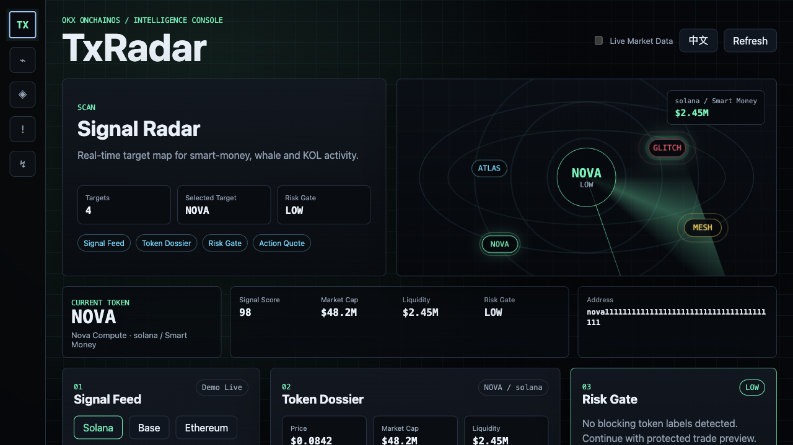
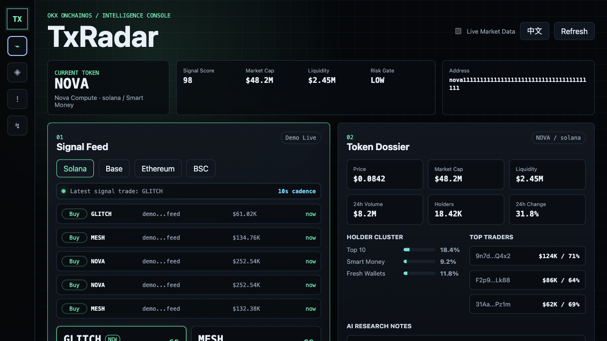
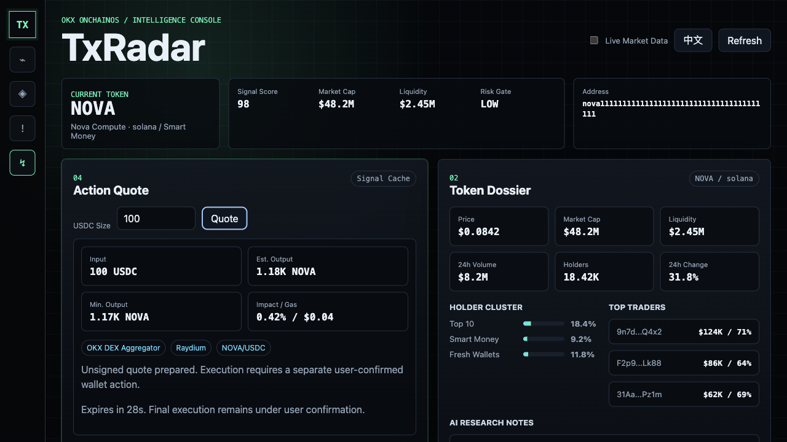

# TxRadar

TxRadar is an OKX OnchainOS intelligence console for detecting high-signal token
activity, evaluating token risk, and preparing protected trade previews.

The product flow is intentionally direct:

```text
Signal Radar -> Token Dossier -> Risk Gate -> Protected Preview
```

TxRadar combines smart-money, whale, and KOL activity with token market context,
holder concentration checks, top-trader signals, and a risk gate before any
trade preview is surfaced.

## Product Surfaces

| Surface | Purpose |
| --- | --- |
| Signal Radar | Maps high-signal wallet activity into an interactive radar view. |
| Signal Feed | Tracks smart-money, whale, and KOL buy signals across supported chains. |
| Token Dossier | Summarizes price, liquidity, holders, top traders, trades, and research notes. |
| Risk Gate | Applies token-scan verdicts before a preview is shown. |
| Protected Preview | Produces unsigned swap previews for user-confirmed execution flows. |

## Screenshots







## Quick Start

```bash
npm start
```

Then open:

```text
http://localhost:4173
```

Useful scripts:

```bash
npm run dev
npm run check
```

## Review Flow

Start in Signal Radar, pick a target, and follow the decision path:

1. inspect signal quality and wallet class;
2. open the token dossier for market, holder, and trader context;
3. review the Risk Gate verdict;
4. prepare a protected preview only when the risk state allows it.

## Live OKX Mode

TxRadar runs locally with a curated market cache and can switch to OKX live data
when credentials and regional access are available.

Apply for credentials:

```text
https://web3.okx.com/onchain-os/dev-portal
```

Create a local `.env` file:

```bash
cp .env.example .env
```

Fill in:

```bash
OKX_API_KEY="your-api-key"
OKX_SECRET_KEY="your-secret-key"
OKX_PASSPHRASE="your-passphrase"
```

Restart the server after editing `.env`, then toggle **Live Market Data** in the
UI.

If the CLI is missing, rate-limited, region-blocked, or returns no usable data,
TxRadar keeps the console reviewable by falling back to `data/market-cache.json`.

## OKX Skill Mapping

| TxRadar area | OKX OnchainOS skill |
| --- | --- |
| Signal Feed | `okx-dex-signal` via `signal list` |
| Token Dossier | `okx-dex-token` via `price-info`, `liquidity`, `top-trader`, and `trades` |
| Risk Gate | `okx-security` via `security token-scan` |
| Protected Preview | `okx-dex-swap` via `swap quote` |

## Project Layout

```text
.
├── data/market-cache.json   # curated market cache
├── public/index.html        # app shell
├── public/app.js            # client entrypoint and event wiring
├── public/js/               # client state, rendering, actions, i18n, formatting
├── public/styles.css        # product UI and radar animation
├── server.js                # HTTP entrypoint
├── server/                  # API handlers, OKX CLI adapter, cache, quote logic
└── package.json
```

## Safety Boundary

TxRadar does not sign, broadcast, force, approve, or execute transactions.

Any future execution path must preserve the OKX confirmation rules:

- require explicit user confirmation;
- run the security scan first;
- never bypass high-risk verdicts;
- keep the audit trail visible before action.
